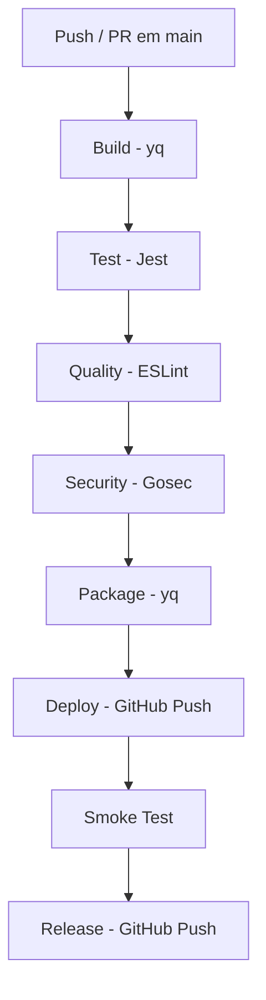

# Relatório da Pipeline CI/CD

Documentação do trabalho: configuração, execução e verificação da pipeline automatizada com GitHub Actions.

**Repositório:** [Dark70941/projetodevopspipeline](https://github.com/Dark70941/projetodevopspipeline)  
**Workflow:** `.github/workflows/pipeline.yml`  
**Gatilho:** push e pull request na branch `main`

---

## 1. Actions do GitHub Marketplace utilizadas

Foram escolhidas **3 Actions** do Marketplace, cada uma aplicada em uma etapa adequada do processo de automação:

### Action 1 — yq (Portable YAML Processor)

| Campo | Valor |
|-------|-------|
| **Marketplace** | [yq - portable yaml processor](https://github.com/marketplace/actions/yq-portable-yaml-processor) |
| **Referência** | `mikefarah/yq@master` |
| **Jobs** | Build, Package |
| **Arquivo alvo** | `config/app.yml` |

**Função:** Processar, validar e converter arquivos YAML. Na pipeline, o yq:

1. Valida se `config/app.yml` possui `app.nome`, `app.versao` e lista de `frases`
2. Extrai a versão da aplicação (`2.0.0`) para os logs do build
3. Converte o YAML para `config/app.json`, usado pelo frontend

**Como contribui para a automação:**  
Elimina validação manual da configuração. Qualquer push com YAML inválido é bloqueado no job **Build**, antes de testes e deploy. A conversão YAML → JSON garante que o frontend sempre use a configuração correta sem edição manual duplicada.

```yaml
- name: Validar configuração YAML com yq
  uses: mikefarah/yq@master
  with:
    cmd: yq -e '.app.nome and .app.versao and (.frases | length > 0)' config/app.yml
```

---

### Action 2 — Gosec Security Checker

| Campo | Valor |
|-------|-------|
| **Marketplace** | [Gosec Security Checker](https://github.com/marketplace/actions/gosec-security-checker) |
| **Referência** | `securego/gosec@master` |
| **Job** | Security |
| **Código analisado** | `tools/validator/main.go` |

**Função:** Análise estática de segurança (SAST) em código Go. Detecta vulnerabilidades como credenciais hardcoded, SQL injection, criptografia fraca e outras más práticas.

**Como contribui para a automação:**  
Adiciona verificação de segurança automática em todo push. O relatório é gerado em formato SARIF e enviado à aba **Security** do GitHub, permitindo auditoria contínua sem ferramentas externas.

```yaml
- name: Executar Gosec Security Checker
  uses: securego/gosec@master
  with:
    args: "-no-fail -fmt sarif -out results.sarif ./tools/..."
```

---

### Action 3 — GitHub Push

| Campo | Valor |
|-------|-------|
| **Marketplace** | [GitHub Push](https://github.com/marketplace/actions/github-push-action) |
| **Referência** | `ad-m/github-push-action@master` |
| **Jobs** | Deploy, Release |

**Função:** Enviar commits de volta ao repositório remoto usando token de autenticação. Utilizado para publicar artefatos sem intervenção manual.

**Como contribui para a automação:**

| Job | O que publica | Resultado |
|-----|---------------|-----------|
| **Deploy** | Conteúdo de `dist/` | Branch `gh-pages` (GitHub Pages) |
| **Release** | `build-info.json` | Metadados do build na branch `main` |

```yaml
- name: Publicar no GitHub Pages com GitHub Push
  uses: ad-m/github-push-action@master
  with:
    github_token: ${{ secrets.GITHUB_TOKEN }}
    branch: gh-pages
    force: true
```

---

## 2. Fluxo da pipeline



| # | Job | Ferramenta principal | Action Marketplace |
|---|-----|-------------------|-------------------|
| 1 | Build | yq + Node.js | ✅ yq |
| 2 | Test | Jest | — |
| 3 | Quality | ESLint | — |
| 4 | Security | Gosec + npm audit | ✅ Gosec |
| 5 | Package | yq + artefato | ✅ yq |
| 6 | Deploy | GitHub Push | ✅ GitHub Push |
| 7 | Smoke Test | Validador Go | — |
| 8 | Release | GitHub Push | ✅ GitHub Push |

---

## 3. Como executar a pipeline

### Execução automática

A pipeline dispara automaticamente ao fazer push para `main`:

```bash
git add .
git commit -m "sua mensagem"
git push origin main
```

### Execução manual (opcional)

No GitHub: **Actions → Pipeline CI/CD → Run workflow**

### Acompanhar execução

1. Acesse [github.com/Dark70941/projetodevopspipeline/actions](https://github.com/Dark70941/projetodevopspipeline/actions)
2. Clique na execução mais recente
3. Verifique o status de cada job (verde = sucesso, vermelho = falha)

---

## 4. Verificação de cada etapa

### Job 1 — Build (yq)

| Verificação | Resultado esperado |
|-------------|-------------------|
| YAML validado | Step "Validar configuração YAML com yq" em verde |
| Versão extraída | Log exibe `Versão da aplicação: 2.0.0` |
| JSON gerado | `config/app.json` criado pelo yq |
| Arquivos essenciais | `index.html`, `script.js`, `style.css` presentes |

### Job 2 — Test

| Verificação | Resultado esperado |
|-------------|-------------------|
| Testes Jest | 7 testes passando |
| Cobertura | Histórico, contador, frases aleatórias |

### Job 3 — Quality

| Verificação | Resultado esperado |
|-------------|-------------------|
| ESLint | Nenhum erro de lint |

### Job 4 — Security (Gosec)

| Verificação | Resultado esperado |
|-------------|-------------------|
| Scan Go | Gosec analisa `tools/validator/` |
| Relatório SARIF | Arquivo enviado à aba **Security** |
| npm audit | Sem vulnerabilidades high/critical |

### Job 5 — Package (yq)

| Verificação | Resultado esperado |
|-------------|-------------------|
| Pacote dist/ | HTML, CSS, JS e config copiados |
| build-info.json | Versão, build number, commit e data |
| Artefato | `app-dist` disponível para download |

### Job 6 — Deploy (GitHub Push)

| Verificação | Resultado esperado |
|-------------|-------------------|
| Branch gh-pages | Criada/atualizada com conteúdo de `dist/` |
| GitHub Pages | App acessível em `https://dark70941.github.io/projetodevopspipeline/` |

> **Configuração necessária:** Settings → Pages → Source: branch `gh-pages`, folder `/ (root)`

### Job 7 — Smoke Test

| Verificação | Resultado esperado |
|-------------|-------------------|
| Validador Go | `Configuração válida: Gerador de Frases v2.0.0` |
| Estrutura HTML | Contém "Gerador de Frases" |
| Histórico no JS | Código de histórico presente em `script.js` |

### Job 8 — Release (GitHub Push)

| Verificação | Resultado esperado |
|-------------|-------------------|
| build-info.json | Atualizado no repositório com dados do build |
| Commit automático | `chore: atualizar build-info - run #N` |

---

## 5. Evidências de execução

Após o push, registre aqui o resultado de cada execução:

| Run | Commit | Status | Link |
|-----|--------|--------|------|
| #1 | feat inicial | Verificar em Actions | [Abrir](https://github.com/Dark70941/projetodevopspipeline/actions) |
| #2 | feat sem co-author | Verificar em Actions | [Abrir](https://github.com/Dark70941/projetodevopspipeline/actions) |
| #3 | chore contribuidores | Security falhou → corrigido | [Abrir](https://github.com/Dark70941/projetodevopspipeline/actions/runs/33671171577) |

### Resultado da execução #3 (antes da correção)

| Job | Status | Observação |
|-----|--------|------------|
| Build | ✅ Sucesso | yq validou YAML e extraiu versão 2.0.0 |
| Test | ✅ Sucesso | 7 testes passaram |
| Quality | ✅ Sucesso | ESLint sem erros |
| Security | ❌ Falhou | Gosec bloqueou pipeline (corrigido com `-no-fail`) |
| Package | ⏭️ Pulado | Dependia do Security |
| Deploy | ⏭️ Pulado | Dependia do Package |
| Smoke Test | ⏭️ Pulado | Dependia do Deploy |
| Release | ⏭️ Pulado | Dependia do Smoke Test |

---

## 6. Conclusão

A pipeline automatiza o ciclo completo de desenvolvimento:

1. **yq** garante configuração válida e sincronizada (Build/Package)
2. **Gosec** adiciona camada de segurança no código Go (Security)
3. **GitHub Push** publica a aplicação e registra metadados (Deploy/Release)

Sem essas Actions, cada etapa exigiria intervenção manual: validar YAML, rodar scanner de segurança e fazer deploy. Com a pipeline, todo o processo é executado automaticamente a cada push.
